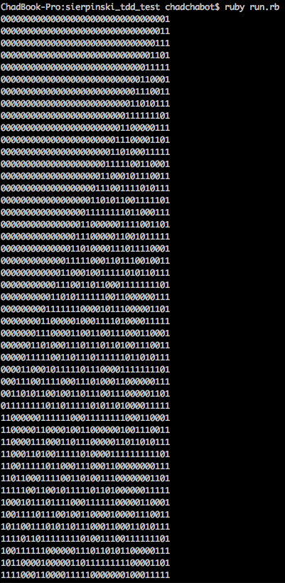

This was an exercise from a meetup where we were practicing TDD.

The basis for this exercise is using a representation of a Sierpinski triangle [https://en.wikipedia.org/wiki/Sierpinski_triangle] generative algorithm.

###How to run the test
`$ ruby run.rb` and watch the screen fill with 1's and 0's, and notice the
fractal triangles in the output. Cool!

###Output
You'll see something like this, but of varying width depending whether or not
you change the `width` value in `run.rb`:

